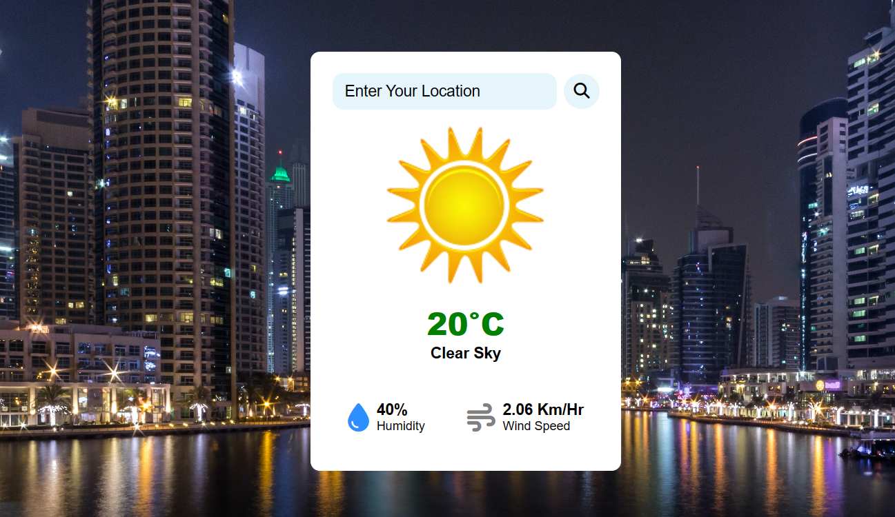

# Weather App

A simple weather app that allows users to check the weather conditions for a specific location.

## Preview



## Features

- Enter the location to get real-time weather information.
- Background image changes based on the searched city.
- Displays temperature, weather description, humidity, and wind speed.
- Informative icons representing weather conditions.

## How to Use

1. Clone the repository:

    ```bash
    git clone https://github.com/your-username/your-weather-app-repo.git
    ```

2. Open `index.html` in your web browser.

3. Enter the desired location in the search box and click the search button.

## Technologies Used

- HTML
- CSS
- JavaScript

## APIs Used

1. OpenWeatherMap API for weather data.
2. Unsplash API for dynamic background images.

## Setup

1. Obtain API keys:
    - OpenWeatherMap API
    - Unsplash API
  
2. Replace the API keys in the `script.js` file:
    ```bash
    const unsplashApiKey = 'your_unsplash_api_key';
    const apiKey = 'your_openweathermap_api_key';
    ```
3. Open index.html in a web browser.

4. Start checking the weather!

## Contributions

Contributions are welcome! If you'd like to contribute to this project, please open an issue or a pull request.

##
**Author:** Mangesh Pangam  
**GitHub:** [Mangesh2704](https://github.com/Mangesh2704)  
**Email:** 202103036.mangeshpkr@student.xavier.ac.in
