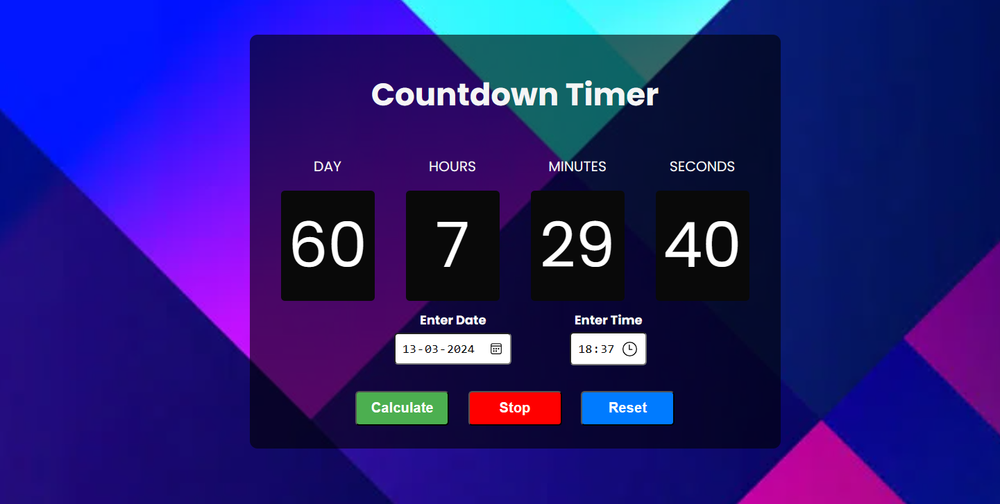

# Countdown Timer

A simple and stylish countdown timer for your web projects. Set a future date and time, and let the timer count down in real-time.

## Features

- User-friendly interface
- Responsive design
- Customizable buttons with distinct colors
- Background image for an enhanced visual experience

## Preview



## Getting Started

1. Clone the repository:

   ```bash
   git clone https://github.com/your-username/countdown-timer.git

2. Open `index.html` in your preferred browser.

3. Set the future date and time, click "Calculate" to start the countdown.

4. Use "Stop" to pause the countdown and "Reset" to restart it.

## Usage

1. Open `index.html` in a text editor to customize the timer or styles.

2. Update the `bg.webp` file in the background-image class with your preferred background image.

3. Modify colors, fonts, and other styles in `styles.css` to match your project theme.

## Contributions

Contributions are welcome! If you'd like to contribute to this project, please open an issue or a pull request.

##
**Author:** Mangesh Pangam  
**GitHub:** [Mangesh2704](https://github.com/Mangesh2704)  
**Email:** 202103036.mangeshpkr@student.xavier.ac.in
